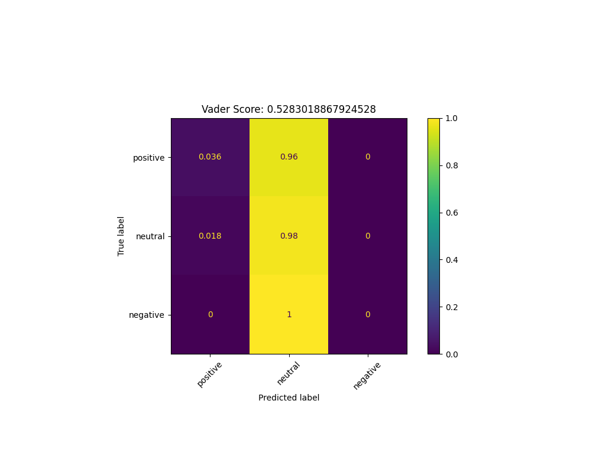

# Twitter Sentiment

## Getting Started

This application is broken into two pieces
* Flask app to manually assign tweet sentiment
* Neural net classifier script

### Set up virtual env, install requirements and create twitter_keys.py
```commandline
python3.6 -m venv .env
source .env/bin/activate
pip install -r requirements.txt
touch twitter_keys.py
    // Add the following keys
    CONSUMER_KEY = ''
    CONSUMER_SECRET = ''
    API_KEY = ''
    SECRET_KEY = ''
```

### Prerequisites

* Docker is installed on your machine.
* A mongodb image is used to host a local mongodb instance. You should mount a volume to persist data
* Start mongodb instance:
 ```commandline
 docker run --rm -d -p 27017-27019:27017-27019 -v <absolute_path_to_local_folder>:/data/db --name mongodb mongo

Example:
docker run --rm -d -p 27017-27019:27017-27019 -v /Users/kieran/Documents/code/twitter_sentiment/data/:/data/db --name mongodb  mongo
```
* Log into mongodb container:
```commandline
docker exec -it mongodb bash
``` 
* Stop container:
```commandline
docker stop mongodb
```

## Running Flask app

Note the app needs the mongodb image to be running see above command.

* Run using docker
```commandline
 docker build -t sent_app:latest  .
 docker run -p 5000:5000 sent_app
```
* Recommended: Run without docker(Still need to have mongodb image running)
```commandline
 // Make sure copy commands mentioned above have been ran or you will see import errors
 python sent_application/app.py
```

### How the Flask app works

The Flask app serves a simple application to manually classify tweets.  
A mongodb instance is used to store the classified tweets for later use in the model. The mongo instance
also store a user session object.

#### Some code
* Classify view function. 
```python
@app.route('/classify/<tweet_id>', methods=['POST'])
def classify_tweet(tweet_id):
    """
    Submit sentiment for a provided tweet
    :param tweet_id: Id of tweet
    """
    session['num_tweets'] = session['num_tweets'] - 1

    print('Tweet ID:', tweet_id, 'Sentiment', request.form['sent'])
    tweet = session['tweets'][session['num_tweets']]
    tweet['sentiment'] = request.form['sent']
    print(tweet)
    db.manually_classified.insert_one(tweet)
    if session['num_tweets']:
        return render_template('classify.html', topic=session['topic'], num_tweets=session['num_tweets'],
                               tweet=session['tweets'][session['num_tweets'] - 1])
    else:
        # Clear out the session
        session.pop('num_tweets')
        session.pop('topic')
        return render_template('search.html')
```

### Sample app views

* Select topic and number of tweets


* Classify tweet


## Building a Sentiment Model

Now that tweets have been collected we can now begin to train a model to predict the sentiment of new tweets .

#### Steps to building a model
* Load tweets from database
```python
def load_tweets(db, collection):
    """
    Load tweets from database
    :param db: Authenticated mongodb instance
    :param collection: Collection of tweets
    :return: List of tweets
    :rtype: list of dict
    """
    positive_tweets = get_tweets_from_collection(db, collection, {'sentiment': 'positive'})
    neutral_tweets = get_tweets_from_collection(db, collection, {'sentiment': 'neutral'})
    negative_tweets = get_tweets_from_collection(db, collection, {'sentiment': 'negative'})

    return positive_tweets + negative_tweets + neutral_tweets
```
* Clean the tweet text. Remove usernames and URLs for example
```python
    def regex(text_):
        """
        Sanitize provided text
        :param text_: Text to clean
        :return: Cleaned up text
        """
        # Remove http links
        text = re.sub(r'http\S+', '', text_)
        # Remove username
        text = ' '.join([word for word in text.split() if '@' not in word])
        # Remove any symbols such as '#'
        text = re.sub(r'[^a-zA-Z0-9 ]', '', text)
        # Remove numbers
        text = re.sub(r"^\d+\s|\s\d+\s|\s\d+$", "", text)
        return text
```
* Generate training and test data
```python
tweet_df = pd.DataFrame(columns=['text', 'sentiment'])
for tweet in all_tweets:
    tweet_df.loc[len(tweet_df)] = [tweet['text'], tweet['sentiment']]        
x_train, x_test, y_train, y_test = train_test_split(tweet_df.text,  tweet_df.sentiment, shuffle=True, random_state=7)
```
* Apply stopping, stemming and tfid
```python
# It is important to reuse the same vectorizer for new data also
tfid_vectorizer = TfidfVectorizer(max_df=0.5, stop_words=stopwords.words('english'), tokenizer=process_text,
                                  max_features=10000)
print('Fitting train data')
x_train_vector = tfid_vectorizer.fit_transform(x_train)
x_test_vector = tfid_vectorizer.transform(x_test)

print(f'Number of features: {len(tfid_vectorizer.get_feature_names())}')

model = MLPClassifier(hidden_layer_sizes=(150,100,50), max_iter=500, random_state=7)
model.fit(x_train_vector, y_train)
```
* Evaluate model using test set. Display Confusion matix
```python
predictions = model.predict(x_test_vector)
score = accuracy_score(y_test, predictions)
result_string = f'{model}: Score: {round(score, 3)}'

# Plot confusion matrix of custom model
cm = confusion_matrix(y_test, predictions, labels=['positive', 'neutral', 'negative'], normalize='true')
plot = ConfusionMatrixDisplay(cm, ['positive', 'neutral', 'negative'])
plot.plot(xticks_rotation=45)
plot.ax_.set_title(result_string)
plot.figure_.canvas.set_window_title('Custom Model Confusion Matrix')
plt.subplots_adjust(bottom=0.25, right=0.80, top=0.75)
```

## Compare model with Vader 
Vader is a open-source sentiment analysis tool for python

```python
def compare_sentiment(x_test, y_test, custom_model_score):
    """
    Compare vader sentiment to model sentiment. Vader does not require training data
    :param x_test: Tweets to test predict sentiment of.
    :param y_test: Actual sentiment
    :param custom_model_score: Score from custom model
    :return: Vaders predictions and accuracy score
    """
    vader_map = {'neg': 'negative', 'pos': 'positive', 'neu': 'neutral'}
    vader_predictions = []
    vader = SentimentIntensityAnalyzer()

    for text in x_test:
        vader_prediction_map = vader.polarity_scores(text)
        vader_prediction_map.pop('compound')
        vader_predictions.append(vader_map[max(vader_prediction_map.items(), key=operator.itemgetter(1))[0]])

    vader_score = accuracy_score(y_test, vader_predictions)
    print(f'Vader scored: {vader_score}')
    print(f'Custom model scored: {custom_model_score}')

    # Same code as above to generate confusion matrix
    # ......

    return vader_predictions, vader_score
```

### Results

Both models performed very poorly. 
```commandline
Number of features: 1424
Vader scored: 0.5441176470588235
Custom model scored: 0.5147058823529411
```
It appears Vader produces a higher accuracy. However lets compare the confusion matrix of both models...
* Vader



* Neural Net


The Vader model only classifies tweets as neutral. This however may be due to the processed tweet.
The testing data provided to the model has had punctuation removed which vader takes into account.
  
The custom model from an accuracy standpoint performs worse, however it can identify some positive
tweets but cannot identify negative tweets.

## Final remarks
Sentiment analysis on tweets is not a straight forward task. Tweets by nature contain slag and poorly 
formatted text. When manually classifying the data I at times struggled to assign a sentiment.  
A larger number of tweets is needed. The dataset contained a majority of neutral sentiment tweets, a balance 
should help improve the model. 


## Authors

* **Kieran Lyons** - *Initial work* - [Kieran7741](https://github.com/kieran7741)
